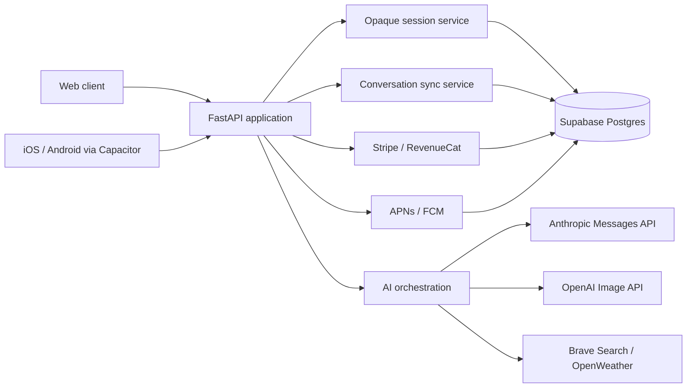

# Ask Crump

Ask Crump is a cross-platform conversational assistant built around a messaging-style interaction model. The application combines a FastAPI backend, Supabase persistence, a web client, and Capacitor-based iOS and Android shells.

The project focuses on three product problems that are easy to overlook in an AI demo:

- conversations should follow the account across devices;
- authentication should survive normal browser and app restarts;
- long-running AI work should feel responsive without presenting simulated progress.

## Product behavior

Ask Crump delivers complete responses as message bubbles rather than streaming partial text. The client presents server-backed message states—`Sending`, `Delivered`, `Seen`, and retryable failure states—alongside an inline activity indicator for reading, searching, creating, or thinking.

Optional **Crump Check-ins** allow users to receive contextual follow-ups. Check-ins are server scheduled, opt-in, quiet-hour aware, suppressed while unanswered, and stored in the originating conversation so every device sees the same history.

## Architecture



### Trust boundaries

- The server is authoritative for identity, account settings, usage limits, subscriptions, and conversation revisions.
- Browser storage is an account-scoped offline cache, not the primary database.
- Web sessions use HTTP-only cookies; native sessions use platform secure storage.
- Provider credentials and Supabase service credentials remain server-side.
- Stripe checkout is available only on the web. Native digital subscriptions use Apple or Google billing through RevenueCat.

## Engineering highlights

- Domain-based FastAPI routers with centralized middleware and exception mapping
- Opaque, hashed, revocable sessions with sliding expiration
- Conflict-aware cross-device synchronization with revisions and deletion tombstones
- Idempotent chat jobs to prevent duplicate replies during retries
- Database-backed rate limiting and usage accounting
- Server-authoritative assistant settings and account identity
- Opt-in proactive messaging with quiet hours and unanswered-message suppression
- APNs and FCM push delivery with installation ownership controls
- Accessible live status updates, reduced-motion support, and native haptics
- Atomic account deletion through a database RPC

## Repository layout

```text
app.py                         ASGI and Vercel entry point
backend/application.py         FastAPI application factory
backend/routes/                Domain routers
backend/*_service.py           Application and provider services
migrations/                    Supabase schema and data migration
public/                        Web application and static assets
scripts/                       Native build and release verification
resources/                     App icon and native launch sources
tests/                         API, security, synchronization, and UI checks
docs/                          Architecture, operations, and release notes
```

## Technical review path

For a focused engineering review, start with:

1. [`docs/ENGINEERING_CASE_STUDY.md`](docs/ENGINEERING_CASE_STUDY.md) for the problem, constraints, and tradeoffs;
2. [`docs/ARCHITECTURE.md`](docs/ARCHITECTURE.md) for runtime boundaries and data flow;
3. [`docs/THREAT_MODEL.md`](docs/THREAT_MODEL.md) for security assumptions and residual risks;
4. [`docs/decisions/`](docs/decisions/) for architecture decision records;
5. [`tests/`](tests/) for executable behavior and regression coverage.

## Local development

### Requirements

- Python 3.12+
- Node.js 22+
- A Supabase project for integration testing

### Start the web application

```bash
python -m venv .venv
source .venv/bin/activate              # Windows: .venv\Scripts\activate
pip install -r requirements.txt
cp .env.example .env
uvicorn app:app --reload --port 3000
```

Open `http://localhost:3000/app`.

The API documentation is available at `/api/docs` outside production.

### Client and native tooling

```bash
npm install
npm run test:js
npm run build
```

Native projects are generated only when needed:

```bash
npm run cap:add:ios
npm run cap:add:android
npm run cap:sync
npm run native:configure
npm run native:assets
npm run native:verify
```

## Configuration

Copy `.env.example` to `.env` and provide the services used by your environment. The minimum backend configuration is:

```text
APP_ENV=development
APP_URL=http://localhost:3000
SUPABASE_URL=...
SUPABASE_SERVICE_KEY=...
ANTHROPIC_API_KEY=...
```

Optional integrations include OpenAI image generation, Brave Search, OpenWeather, Resend, Stripe, RevenueCat, APNs, and Firebase Cloud Messaging.

Never commit `.env`, service-account JSON, APNs private keys, Supabase service-role keys, or billing secrets.

## Quality checks

```bash
ruff check app.py backend tests
python -m compileall -q app.py backend
pytest -q
npm run test:js
```

CI runs the same Python and JavaScript checks on pushes and pull requests.

## Deployment

The repository is structured for Vercel's FastAPI runtime and static `public/` hosting. The production sequence is documented in [`docs/DEPLOYMENT.md`](docs/DEPLOYMENT.md). Mobile release requirements are documented in [`docs/STORE_RELEASE_CHECKLIST.md`](docs/STORE_RELEASE_CHECKLIST.md).

Run the database migration in a staging Supabase project before production. Existing pre-migration sessions are intentionally invalidated because legacy credentials cannot be converted safely into the opaque session format.

## Security and privacy

Security issues should be reported privately using the instructions in [`SECURITY.md`](SECURITY.md). The application includes rate limits, request-size enforcement, secure session handling, account-isolated caches, restricted CORS, no-store API responses, and explicit account deletion.

The legal and privacy pages included in the client are product drafts and should be reviewed by qualified counsel before a public commercial launch.

## Project status

The repository contains release-oriented source code, not signed App Store or Google Play binaries. Store records, signing credentials, production provider accounts, privacy declarations, and real-device validation remain deployment responsibilities.

## Author

Designed and developed by **Gregory D. Crump Jr.** under Clever Crump.
