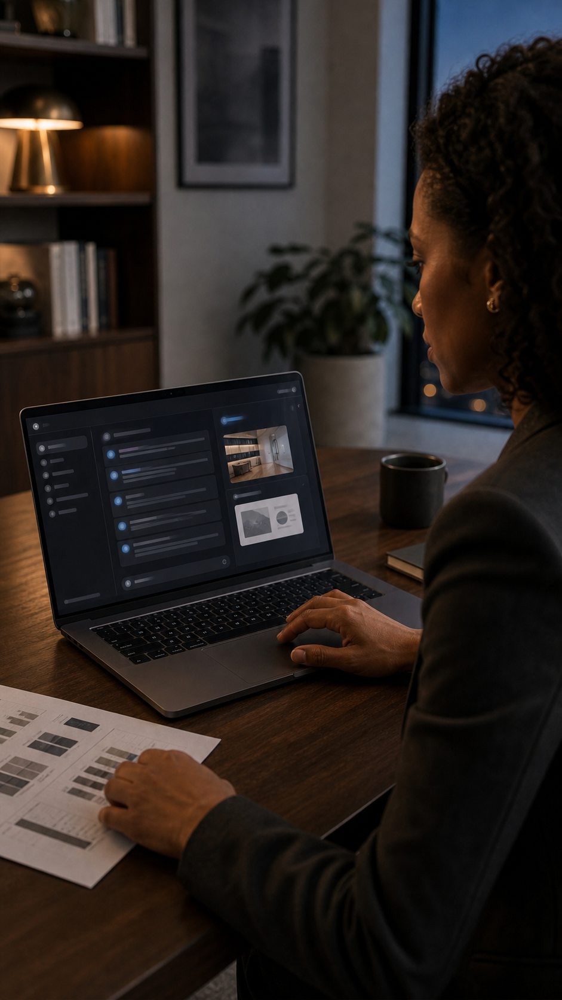
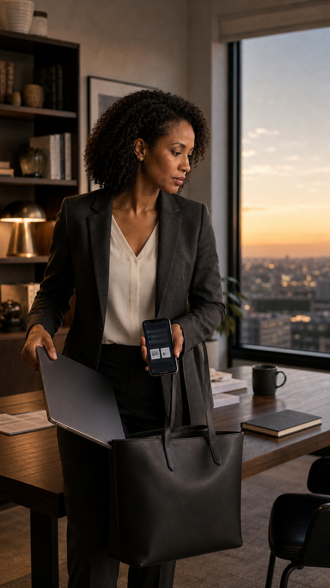
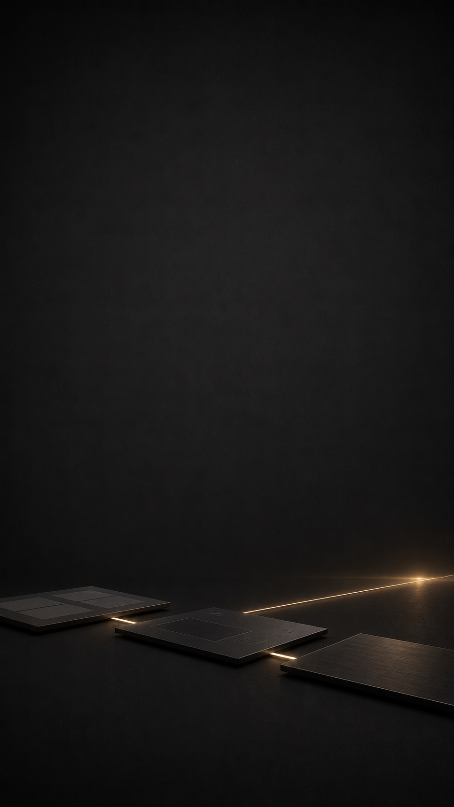

# Ask Crump — “Work That Continues” ad storyboard

Date: 2026-08-29

Status: production-ready creative brief; not yet approved for public release

Primary format: 9:16 vertical, 1080 × 1920, 24 fps, approximately 18 seconds

## Creative decision

The ad should sell a user outcome, not the novelty of generated video. One professional moves from
fragmented research to an organized workspace, carries the work across devices, and delivers the
result. The visual language is restrained charcoal, walnut, ivory, and muted gold. All brand text
and the official Ask Crump mark must be added in post rather than generated inside a scene.

This storyboard is a campaign direction. It is not evidence that every frame shown was exported by
the current Ask Crump video provider.

The normalized source prompt set is preserved in
assets/storyboards/work-that-continues-v1/prompts.md.

## Frame sequence

### 01 — Fragmented work · 0:00–0:02.5

- **Story:** Yesterday’s research is present, but the work is still spread across paper, phone, and
  laptop.
- **Motion:** A slow 3% push-in. Natural typing only. Keep the cup, papers, phone, face, and hands
  stable.
- **Edit:** Start on room tone and a nearly silent low piano note. Do not add on-screen copy yet.

### 02 — One workspace · 0:02.5–0:05.5

- **Story:** The same work becomes visible in one practical workspace.
- **Motion:** Subtle rack focus from the printed brief to the laptop. Use one restrained cursor
  movement; do not animate individual letters or invent readable interface text.
- **Edit:** Cut on the trackpad touch. Add one quiet interface tone.

### 03 — Finished outputs · 0:05.5–0:08.5

- **Story:** The workspace now holds a presentation, document, and research summary.
- **Motion:** Let the three preview cards settle into place with a short ease-in. No particles,
  holograms, or magical transformations.
- **Post-production copy:** Optional single line, set in a clean sans serif: **“From research to
  ready.”**

### 04 — Work continues · 0:08.5–0:11.5

- **Story:** The laptop is packed while the same workspace remains available on the phone.
- **Motion:** Animate only the laptop lowering into the tote and a slight body turn toward the
  doorway. Keep the phone screen, face, fingers, bag straps, and room geometry stable.
- **Edit:** Use a natural fabric movement sound. Avoid a flashy device-transition effect.

### 05 — Work delivered · 0:11.5–0:15

- **Story:** The result is useful beyond the chat: it supports a real decision and presentation.
- **Motion:** Slow 2% dolly-in with one small, natural presenting gesture. The display should remain
  static and text-free.
- **Edit:** Let the music resolve here. Do not add applause or a triumph cue.

### 06 — Official brand end card · 0:15–0:18

- **Story:** Conversation, project context, and finished work remain connected.
- **Motion:** Move the thin gold light once from the nearest plane toward the horizon. Everything
  else stays still.
- **Branding added in post:** Center the untouched official Ask Crump horizontal light master in the
  open area. Beneath it, add **“An AI workspace for work that continues.”** Add
  **“askcrump.com”** as the only call to action near the lower safe area.

## Voice and sound

Preferred version: restrained voiceover with licensed ambient music and minimal sound design.

> Yesterday’s research. Today’s presentation. Tomorrow’s next step. Ask Crump keeps the work
> together, so you can keep moving.

If voiceover reduces clarity, remove it. The visual story must remain understandable with sound off.
Any ElevenLabs voice must be licensed for commercial use, use a voice the company has the right to
deploy, and be documented with the final campaign source files.

## Generation and edit constraints

- Use these images as shot anchors, not loose inspiration. Preserve the same protagonist’s identity,
  wardrobe, earrings, hair, age, skin tone, and proportions in frames 1–5.
- Use image-to-video with low motion strength. Prefer camera movement and one physical action per
  shot over scene-wide transformation.
- Do not generate the Ask Crump logo, tagline, URL, subtitles, or interface copy. Add all typography
  and the official logo in the editor.
- Keep screens practical and subdued. No floating UI, neon grids, particle effects, or holograms.
- Do not introduce new people before frame 5.
- Export one silent review copy before adding music, voice, and branding so visual defects remain
  easy to spot.

## Delivery specification

- 1080 × 1920 H.264 MP4, 24 fps, AAC audio, web-optimized fast start.
- Keep essential action and all post-production text inside platform-safe vertical margins.
- Also export a clean 1080 × 1920 version without captions or music, plus a 1:1 crop only after the
  vertical master is approved.
- Retain the six source images, generation prompts, provider/project identifiers, edit project, audio
  license, voice license, and final exports in the campaign archive.

## Release gate

Do not publish until a frame-by-frame review confirms stable identity, natural hands, believable
device geometry, no generated words or marks, a single measurable call to action, licensed audio and
visual provenance, mobile-safe text, and a clean official-logo composite. Public posting remains a
separate owner-confirmed action.
